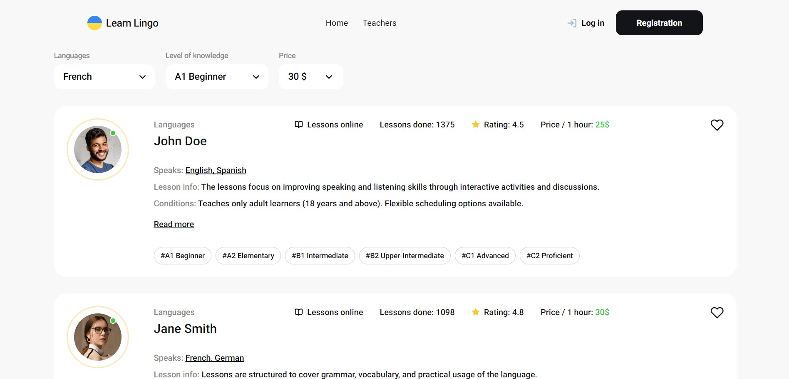

# Learn Lingo

Summary: Learn Lingo it's a web application for people who want to learn a
foreign language with teacher. The application gives a big choice of teachers
from different parts of the world. Also Learn Lingo provides a
registration/login system for creating an account, which is need for
adding/removing teacher from favorites.

## PAGES:

### -Home: 

The main page of the site. On the page there are interesting statistic of
teachers, and link that redirects on teachers page.

### -Teachers:

This is the page with language tutors. Information about each teacher is
compactly, but meaningfully collected here. By clicking on the button "Read
more", you can read about teacher's experience, reviews, and book a trial
lesson.

Also the web site provides authentication system, an account allows you to add
and remove teachers from the favorites page.

**Functional of adding/removing to favorites is available only for authenticated
users**

### -Favorites:

On the page "Favorites" located the list of teacher that are selected as a
favorites.

**Design for mobile/tablet** There is adaptive and responsive design on the page
for comfortable using on devices like: mobile, tablet etc.

Features: authentication with Firebase, pagination, adding/removing card from
favorites, mobile-menu. Tech stack: HTML5, CSS3, JavaScript, React. && Firebase.
